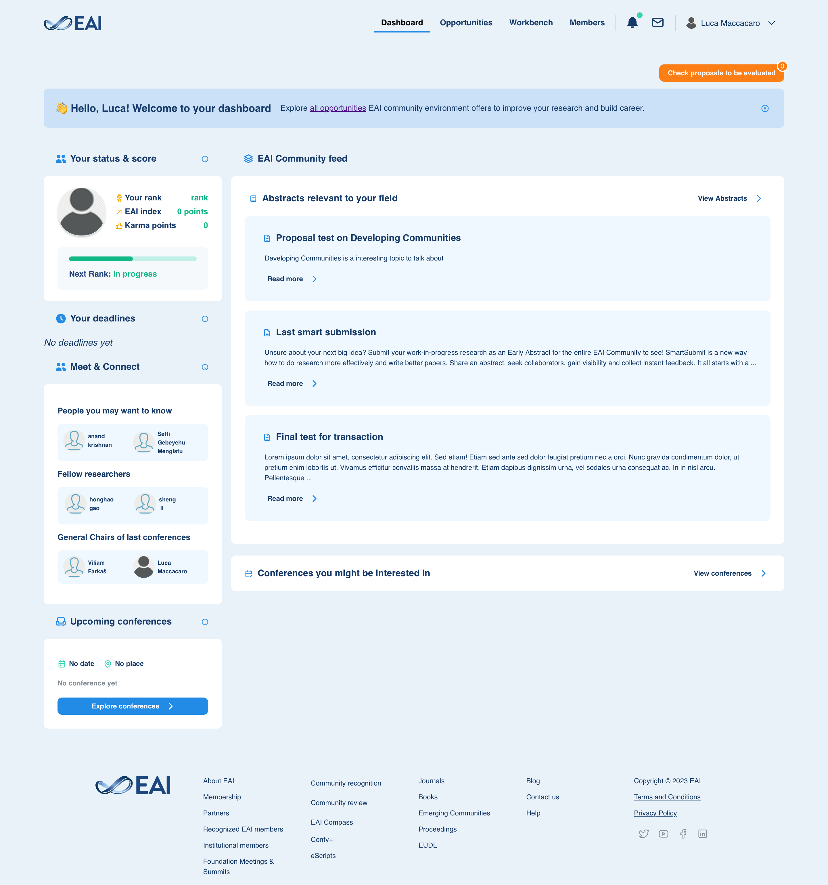
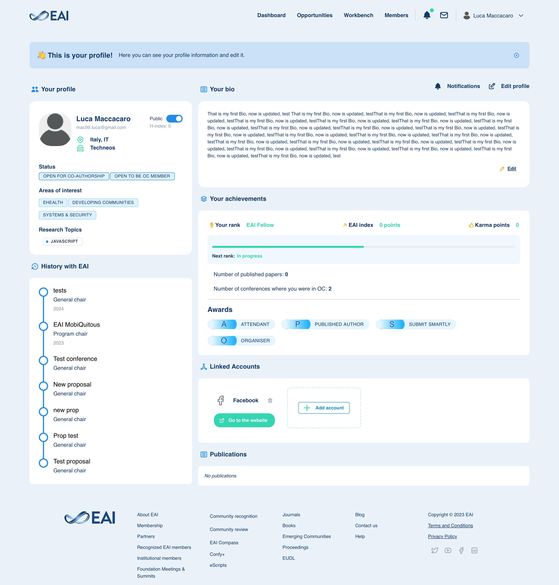
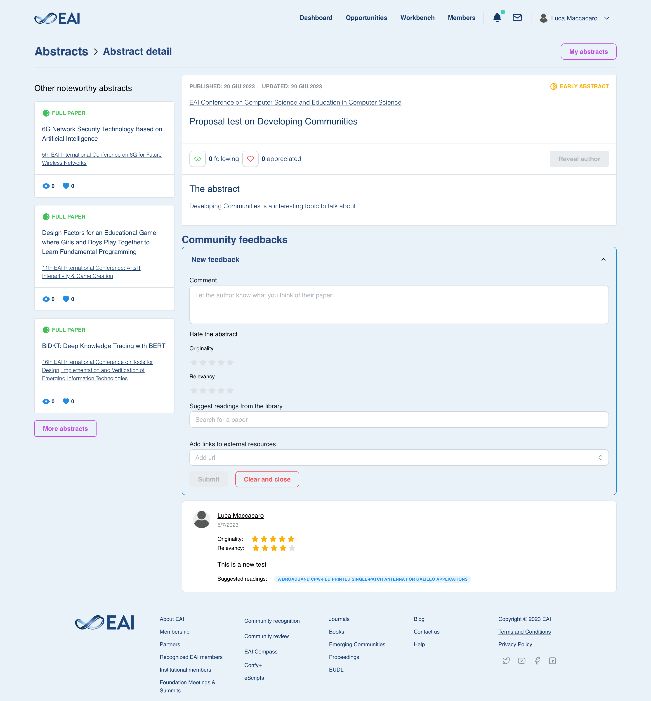

### 🌐 Researcher Network Platform – Web App for European Alliance for Innovation

Developed in collaboration with [EAI (European Alliance for Innovation)](https://eai.eu), this platform was designed as a digital hub for researchers, conference participants, and innovation experts across Europe and beyond.

🔍 The goal: to foster collaboration, communication, and visibility in the research ecosystem by offering tools tailored to academic and scientific workflows.

🔹 Key Features:

- 👥 Social networking for researchers: user profiles, follow system, project boards
- 💬 Real-time chat and project-based messaging between attendees
- 📅 Conference & event integration: connect users around specific events or interests
- 🧩 Project collaboration tools: shared spaces, contributor roles, updates & discussions
- 🔗 Cross-platform integration with external services (for CFPs, paper publishing, and conference submissions)
- 💡 Designed to support thousands of users with a modern, responsive UI and a focus on performance and modularity.

##### 🔧 Tech Stack & Architecture:

- Built with RedwoodJS (React + GraphQL + Prisma)
- Integrated WebSockets for real-time messaging
- External system integration via REST APIs and OAuth2
- Auth system with role-based access and secure user sessions
- Deployed on a Linux VM using Docker, with NGINX as a reverse proxy
- Database: PostgreSQL, with Prisma ORM and custom schema migrations
- CI/CD using GitHub Actions + manual staging pipelines

##### 🎯 My responsibilities:

- Led frontend architecture and state management in React
- Designed and implemented core data models for users, events, and collaboration
- Integrated external APIs for paper submission and conference proposals
- Focused on performance and accessibility to support low-bandwidth users
- Worked directly with EAI stakeholders to define product scope and deliver iterations

📸 **Demo & Screenshots**

Due to the complexity of the system and integration with private EAI services, a live demo is not publicly available.

However, here are selected screenshots showcasing key parts of the application:
- User profile and networking interface
- Project collaboration dashboard
- Conference discovery and proposal flow
- Abstract edit and preview

<table style="border-collapse: collapse; width: 100%;">
  <tr>
    <td align="center" valign="bottom" style="width: 50%;">
      
      
📊 Dashboard Overview

    </td>
    <td align="center" valign="bottom" style="width: 50%;">
      
      
👤 Researcher Profile

    </td>
  </tr>
  <tr>
    <td align="center" valign="bottom" style="width: 50%;">
      
      
📄 Conference Proposal

    </td>
    <td align="center" valign="bottom" style="width: 50%;">
      
      
🔗 Abstract Preview

    </td>
  </tr>
</table>

*Screens and UI elements have been reviewed to ensure no confidential data is shared.*

